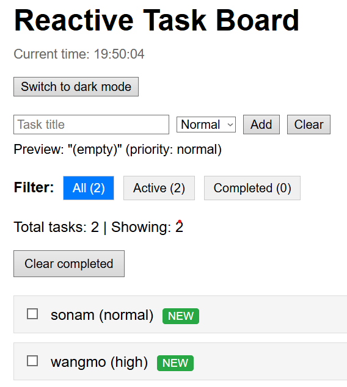
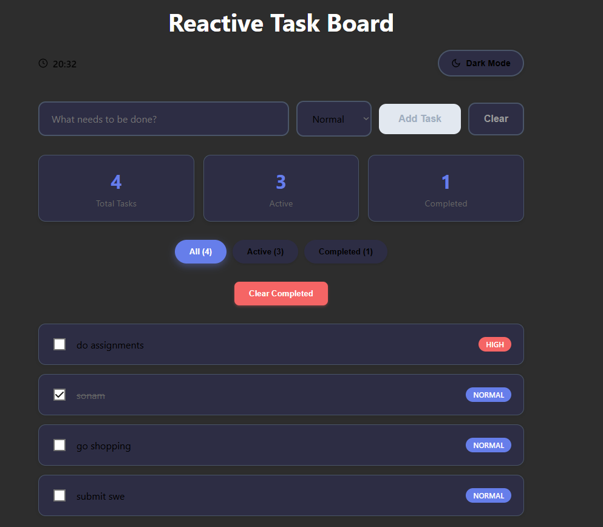

### Github Link
https://github.com/sowomo123/SWE201_02240363.git

# Reactive Task Board

A modern React task management application demonstrating various React hooks and patterns.

## About This Project

This project is a comprehensive demonstration of React hooks including:
- **useState** for managing form inputs and component state
- **useEffect** for localStorage persistence and real-time clock updates
- **useContext** for theme management (light/dark mode)
- **useReducer** for complex state management with task actions
- **Custom hooks** for reusable logic (useLocalStorageState, useTasks)

## Features

- Add, edit, and delete tasks with priority levels
- Filter tasks by status (All, Active, Completed)
- Real-time clock display
- Dark/light theme toggle
- Persistent storage using localStorage
- Modern UI with smooth transitions and animations
- Responsive design

## Challenges Faced

- **State Management Complexity**: Transitioning from simple useState to useReducer required careful planning of action types and state structure
- **Theme Consistency**: Ensuring proper color application across all components while maintaining accessibility and visual hierarchy
- **Component Communication**: Implementing useContext to avoid prop drilling while maintaining clean component boundaries
- **LocalStorage Synchronization**: Managing side effects properly to prevent data loss and ensure consistency across browser sessions
- **Custom Hook Design**: Creating reusable hooks that are flexible enough for different use cases while maintaining simplicity
- **Performance Optimization**: Balancing re-renders and state updates to maintain smooth user experience
- **Responsive Design**: Adapting the modern UI layout to work seamlessly across different screen sizes

## Images

### Light Mode Preview

The application in light mode featuring a clean gray background with black text, modern card-based layout, and blue accent colors.

### Dark Mode Preview  

Dark mode interface with dark gray background, maintaining the modern card design and ensuring good contrast for readability.

## Technologies Used

- React with functional components and hooks
- Modern CSS-in-JS styling
- Component-based architecture
